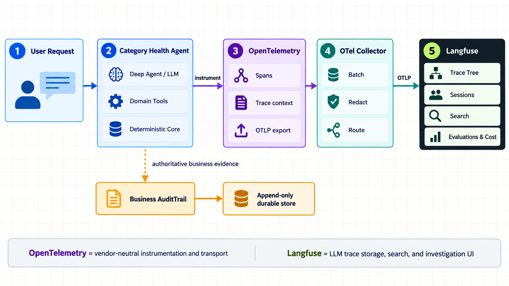

# Guide 19 — OpenTelemetry and Langfuse architecture

> Status: implemented directly through the OpenTelemetry-native Langfuse Python SDK.
> See `GUIDE_20_LANGFUSE_IMPLEMENTATION.md` for code flow and configuration.

## Responsibilities

| Component | Responsibility |
|---|---|
| Category Health Agent | Runs the LLM, domain tools and deterministic analytics core |
| OpenTelemetry | Creates vendor-neutral traces and nested spans with shared trace context |
| OTel Collector | Batches, redacts and routes telemetry outside the request process |
| Langfuse | Stores and displays LLM-oriented traces, sessions, evaluations and costs |
| Business AuditTrail | Preserves authoritative domain evidence independently of observability |
| Append-only durable store | Retains business-audit records according to compliance policy |

The two output paths are intentionally separate. Langfuse makes agent execution
comfortable to investigate. The business audit remains the authoritative record of
validated queries, retrieved objects and deterministic calculations. Losing or
changing the observability backend must not remove that business evidence.

## Implementation sequence

1. Map one user turn to an OpenTelemetry trace.
2. Map each current `AuditTrail.step()` to a named child span.
3. Attach safe summaries by default; redact or omit sensitive raw inputs and outputs.
4. Export spans over OTLP/HTTP directly to Langfuse for the local phase.
5. Add an OTel Collector in production for centralized redaction and routing.
6. Keep `JsonlAuditSink` as the local fallback while adding a durable production sink.
7. Replace the large Streamlit JSON view with a compact summary and trace link.
